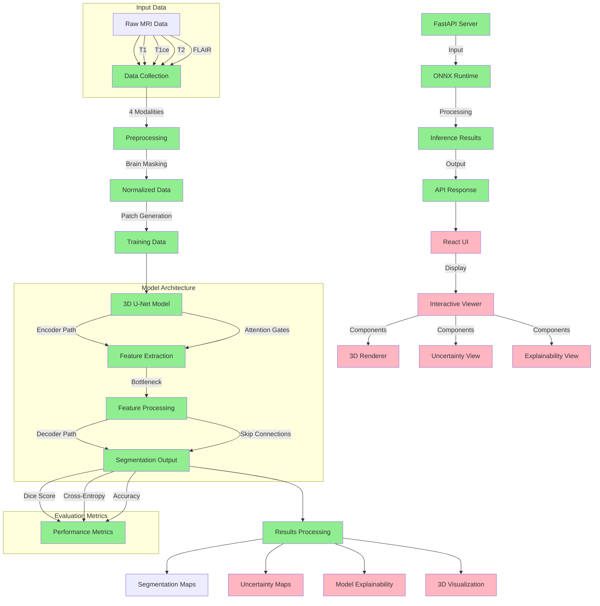

### Legend
- 🟢 Green: Implemented Features
- 🔴 Red: Planned Features

### Implementation Status
1. **Implemented (🟢)**
   - Data Collection & Preprocessing
   - Model Architecture & Training
   - Basic Backend Integration
   - Performance Metrics
   - ONNX Export

2. **Planned (🔴)**
   - Segmentation Visualization
   - Uncertainty Quantification
   - Model Explainability
   - 3D Rendering
   - Interactive Frontend

### Next Steps
1. Implement visualization components
2. Add uncertainty estimation
3. Develop explainability features
4. Create 3D renderer
5. Complete frontend integration